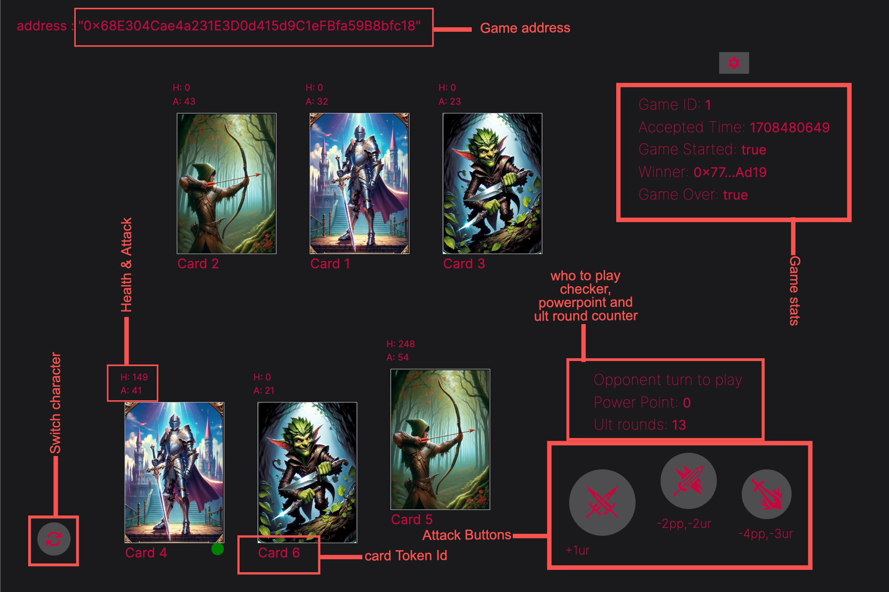

## Webapp for Realm clash

This is a minimalist DAPP for the realm clash contract

Steps to run project

- fork project
- cd to webapp dierectory
- this project is using npm so install dependencies
- rename env to .env.local, add your project ID from wallet connect
- start application `npm run dev`

#### Issues Details

Currently, the front end has not been equipped to be able to equip or detach weapon on this route /charactercard/[id]

## How to play game
Visit [the game website](https://realmclash.vercel.app/)
For better experience, connect your wallet on opBNB testnet        
Navigate to `/portfolio` on the navbar and use the faucet button (no need to get more test characters if you already have some)    
Navigate to `/game` if you are requesting a game or `portfolio` if you are accepting a game. 
Then use the inputs, player id is the address of opponent or other player, you can find the game address in the portfolio section or in `/activities`    

Rules for the game
when you start the game, random numbers(power points) will be generated to decide who goes first, the one with the higher powerpoint goes first       
You must have an active character, so the first move to make by both parties is Switch character   
UlT points is gotten when you finish your turn, the 2ult and 3ult move require the comsumption of ultpoints and power point to multiply damages    
When you run out of ultpoints and powerpoint for a move such as (2ult or 3ult), the contract is design not the let the function fail, but delivering the base power as a normal attack, it was made for convience.   
Both parties must use their power points and ultpoints strategically to overcome one another.    
When a character dies in a team (H = 0), the game would end and the winner would be the last man standing.

check `/Images/gameimages` in the root project github for nice pictures or a match pictures e.t.c    
green dot = active character after calling switch character      

The game is pretty self explanatory.  
